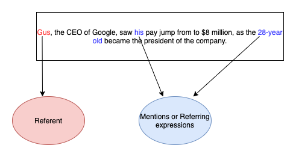

# Question Answering System
This is a question answering system using stories from Aesop’s Fables, ROC stories corpus and MC test. 
The question answering (Q/A) system can process a story and a list
of questions, and produce an answer for each question. 

## NLP Pipeline

The diagram as a whole refers to the NLP pipeline, but the blue specifically is the Question Answering Pipeline.

## Data 

Each story is segmented into sentences, and each story and sentence is assigned an id.
Each question comes from one of the stories, and has each of the questions have their own ids.
Each question id is also associated with a story id.
The answers are also provided, but purely for scoring purposes.  

The job of the QA system is to find the sentence id where the answer is located and then find the answer
text within this sentence. Sometimes there is more than one correct answer and sometimes there are no correct answers.  

## Scoring
Measures of performance are precision, recall, and f-measure.   
F-measure is the tradeoff between precision and recall:  
 f-measure = (2* precision * recall)/(recall + precision).  

Precision is the fraction of an answer that is considered correct. 
Recall is the fraction of an answer that is returned vs the complete answer text.  

tp = true positive, which is an outcome where the model correctly predicts the positive class.   
tn = true negative, which is an outcome where the model correctly predicts the negative class.   
fp = false positive, which is an outcome where the model incorrectly predicts the positive class.  
fn = false negative, which is an outcome where the model incorrectly predicts the negative class.  

Precision = tp/(tp + fp)
In other words the precision is the percent of true positive over the number of positives.    
Recall = tp/(tp + fn)
The recall is the percent of true positives over the number of answers.  

For example, suppose the Question Answering system comes up with an answer to a given question, where the answer was:  
"Messi is phenomenal"  
However, the correct Answer is:  
"Lionel Messi"  
  
In this case, the recall would be 1/2 because the QA system found "Messi", but not "Lionel". 
The precision score is 1/3 because 1 out of the 3 words is correctly generated.  
The F-measure is:  
(2 * 1/2 * 1/3)/(1/2 + 1/3) = 1/3/(5/6) = 1/3 * 6/5 = 2/5 
                                                    = .4  

One can achieve a high recall if all the right answers are generated along with a lot of extra noise.  
On the other hand, high precision is when all returned answers must be correct.  
It is difficult to do well on both.  

>   Results we achieved:  
    AVERAGE RECALL =  0.6006  
    AVERAGE PRECISION = 0.5187   
    AVERAGE F-MEASURE = 0.4994  

## Sentence Retrieval 
Since, we are already given the story id associated with a question, we know where to look for the sentence which has the 
answer for that question. 

### Baseline 
The baseline method for sentence retrieval is to find the overlap between the words in a given sentence and a question. 
That sentence id is returned as the sentence that contains the answer. 

Accuracy = 53%

### Method 1 

Firstly, we tokenize the sentences in  a given story.
Then the question is tokenized, and stop words and pos tags(part of speech tags) are removed.
A word is removed from a question is the pos tag isn't NN (noun phrase), RB (adverb), or VB(verb).
The last question word is appended to the question if it was removed because it was found to be a significant factor in determining answers.
Then the highest overlap is compyted between question and sentence in story, this sentence id is returned.
If highest overlap was 0 for each sentence in the story, the path similarities between each question word and each sentence word are added up using synsets.
The “highest” path similarity sentence is returned.  

Accuracy = 63%

### Method 2 

Each sentence was tokenized. Then each word stem was found using the snowball stemmer. 
The sentence with the highest amount of stem overlap between question and sentence was returned.
The “pywsd” library was used to find most likely synsense of each word. 
The stemmed synonyms of chosen synsense were compared and weights were assigned to the different parts of speech.
Weighted verbs vs nouns vs adjectives:
> Verbs 1.5  
  Nouns  .5  
  Adjectives .5  
  Everything else 1  

Stemmed synonyms of each word sense of each word in the sentence and question were compared.

Accuracy = 67%

### Final Method
Deepavlov BERT was used for sentence retrieval.
To install deeppavlov:  
    pip3 install -q deeppavlov  
    python3 -m deeppavlov install tfidf_logreg_en_faq  
  

Accuracy = 69.97%

## Answer Retrieval NLP techniques

### Named Entity Recognition (NER)

A named entity is anything that can be referred to with a proper name, whether that be a 
person, a location, an organization, etc.
They are commonly extended to include things that aren’t entities per se, including dates, times, and other
kinds of temporal expressions, and even numerical expressions like prices.

To use NER in nltk:

> import nltk  
from nltk import word_tokenize, pos_tag, ne_chunk  
sequence = "Gus thought Bob should buy some tacos."  
print(ne_chunk(pos_tag(word_tokenize(sequence))))    
>> (S  
    &emsp;(PERSON Gus/NNP)  
    &emsp;thought/VBD  
    &emsp;(PERSON Bob/NNP)  
    &emsp;should/MD  
    &emsp;buy/VB  
    &emsp;tacos/NNS  
)  
  
For the QA system, NER is used for sequence labeling with when questions.

### Spacy
Spacy is another form of Name Entity Extraction.

> import spacy    
nlp = spacy.load("en_core_web_sm")  
sentence1 = "Gus thought Bob should buy some tacos."
sentence2 = "He went to church on Sundays."  
doc = nlp(sentence1)  
print("Named Entities:", [(ent.text, ent.label) for ent in doc.ents])     
>>  Named Entities: [('Gus', 'PERSON'), ('Bob', 'PERSON')]  

> doc = nlp(sentence2)  
print("Named Entities:", [(ent.text, ent.label) for ent in doc.ents])  
>>  Named Entities: [('Sundays', 'DATE')]  
  
For the QA system, Spacy is used for label name entities with when and what questions.

### Coreference Resolution
These are important for natural language understanding of a task or statement. Coreferencing is about identifying all mentions 
that refer to the same-real world entity.

The coreferenced stories can be seen in the data/hw8-stories-coref.tsv
These are used for the where and when questions with the QA system.

### Chunking
Chunking is shallow-non-recursive parsing, where segments of a sentence are turned into a sequence of syntactic constituents,
otherwise, chunks and labels. It is an efficient and robust approach to parsing natural language and a popular alternative to full parsing. 
Chunks are defined as non-overlapping regions of text, which contains a head word (ex: noun, verb) and adjacent modifiers and function words.

This is an example of chunk structure:
> (S: (NP: 'I')  
    &emsp; 'saw'  
    &emsp; (NP:'the' 'big' 'dog')  
    &emsp;'on'  
     &emsp; (NP:'the' 'hill'))  

In the QA system, regex tag patterns are used to extract chunks. NLTK provides a regular expression chunk parser that allows one to define 
the kinds of chunks that you are interested in, and then chunk the tagged text.

The chunk parser begins with a structure, in which no tokens are chunked. Each regex pattern or chunk rule is applied successively to update the 
chunk structure. Once all the rules have been applied the resulting chunk structure is returned.

Examples of regex tag patterns:
> \<NN\>+ matches one or more repetitions of the tag string \<NN\>.  
  \<NN.\*\> matches any single tag starting with NN.  
  \<DT\>?\<JJ.\*\>\<NN.\*\> matches an optional determiner(DT), followed by 0 or more instances of adjectives\<JJ.*\>, ending with any type of noun phrase (NN).  

The QA system uses chunking with regexes in nltk.
> import nltk  
  sentence = [("the", "DT"), ("little", "JJ"), ("blue", "JJ"), ("fish","NN"), ("swam", "VBD"), ("to","TO"), ("the", "DT"), ("food", "NN")]  
  grammar = "NP: {\<DT\>?\<JJ\>\*\<NN\>}"   
  cp = nltk.RegexpParser(grammar)  
  result = cp.parse(sentence)  
  print(result)  
  >> (S  
       &emsp;(NP the/DT little/JJ blue/JJ fish/NN)  
       &emsp;swam/VBD  
       &emsp;to/TO  
       &emsp;(NP the/DT food/NN))  

  
For the QA system, Chunking is used for what, where, and why questions.

### Dependency Parsing and Constituency Parsing
Dependency and Constituency parsing are very complicated. They are essentially ways to parse consistuency and dependency structures. These 
structures are different ways to store a sentence's language parts in tree form. The structures are obtained by converting the output of "Stanford Parser Dependencies"
to "universal dependencies".

More information about parsing can be found in the Demos folder.

This is an example of a constituency tree:
       

This is an example of a dependency tree:     
  

## Answer Retrieval

Answer retrieval was split up into the different types of questions supplied
based on the first word of the question.

### Where Questions
Method 1 -
  
    Dependency parsing is utilized for this type of question by first finding the root word of the 
    question dependency parse and lemmatizing it. Then this word is compared with each word in the 
    sentence selected through the values of the story dependency parse after lemmatizing the story words.
    If the lemmatized root word matches with the lemmatized story word, we have our "story node". 
    We then get the dependents of this word by comparing it with the other nodes in the the story through the 
    address of the "story node" and the head of a node in the story if the relationship is nmod.

    If there is no "story word found in the lemmatized comparison mentioned earlier, we try to find the last 
    question word in the sentence dependency parse leaves. If it is there, we slice the sentence from that word 
    to the end of the sentence.

Method 2 -  
  
    If the above method does not work, we use chunking with a grammar of 
    "INNP: {<TO|IN><PRP.+|DT>?<JJ>*<NN.*>+<POS>?<NN.*>*}".If there was only one tree found in the sentence given 
    this grammar, the INNP answer phrase in that tree without the pos tags is returned.   
    If there is more than one tree found in the sentence, we compare the last question word after
    tokenizing the question to see if that question word was in the sentnce. We find this word in
    the sentence and slice the sentence from this question word to the end of the sentence and return.
    (similar to second paragraph of method 1). 
    If this method does not work, we find the most similar coreferece in the 
    text fields of each coreference in the story to the sentence in terms of overlap.

### Who Questions
Method 1 -  
   
    For the who questions, constituency parsing is utilized to find the first noun phrase in the sentence.
    This is a simplistic approach, but it yielded a higher f-measure than the prior approach. 

Prior Approach - 
    The prior approach was to firstly use
    chunking with a grammar of "NPVBD: {<PRP.+|DT>?<JJ>*<NN.*>+<VBD>}". We search 
    through this tree to find the Noun phrase with the verb and return the answer phrase
    without pos tags with the verb removed.

    If there is no NPVBD found, we use name entities to find phrases in the sentence that 
    have a name entity of 'PERSON' or 'ORG'.

    If there are no name entities found, we find the noun phrases in the sentence with the 
    spacy.

### When Questions
Method 1 -  
  
    For when questions, first WHADPV phrases are checked in the constiuency parse tree. If one exists, the correct subtree is determined.

    If not, then check NER for time, data, cardinal, etc. Find NER word if it exists, then find corresponding noun phrases
    in const tree

Method 2 -   
  
    For the when questions, we first try and find the spacy generated name entities of the 
    sentence retrieved. If there are name entities in the sentence that have the name entity
    of 'CARDINAL', 'DATE', or 'TIME', we return them.

    If this method does not work, we try and find the same name entities mentioned above in the 
    coreferences and return the most likely one.

### Why Questions
Method 1 -  
  
    To implement the why questions we tokenized the question to find the last word of it and
    tokenized the sentence to compare the last question word to the sentence tokens. If the 
    last question word was present in the sentence tokens we slice the sentence from that word
    in the sentence to the end of the sentence. Then we remove punctutaion in the sentence and 
    return it.

    If this method does not work, we use chunking with a grammar of 
    "INNP: {<PRP.*><VBD><PRP.*|JJ|DT|RB|MD|CD|IN|VB.*|TO>*<NN.*|RB>+<POS>?<NN.*>*}". We find
    the tree that contains the INNP and return the answer phrase of it without the pos tags 
    attached. 

Method 2 (synonyms, path similarity utilized) -  
   
    After finding the root word in the question, we use path similarity between that lemmatized word 
    and each lemmatized word in the sentence. The word that returns that highest path similarity
    with the root question word is used as the index in the sentence that we will slice the 
    sentence from and return.

Method 3 (dependency parsing utilized) -  
  
    Same as method 1 for where question.

### Binary Questions(did/had/was, etc...):
We could not find an approach to use constituency parsing, dependency parsing, synonyms, 
hyponyms, or hypernyms that yielded a better f-measure than our approach in the last assignment.
  
Method 1:  
  
    Used nltk's SentimentIntensityAnalyzer() after downloading the vader_lexicon to find the 
    negative words in a tokenized sentence. If negative words were present in the sentence,
    no is returned, else yes is returned.

    For example:
        Has Gus ever been to the circus?
            Gus has not been to the circus.
        
        Since not is a negative word, we return:
            No, Gus has not been to the circus.
        
### Which Questions
Method 1 (constituency parsing utilized) -   
  
    There was a very low frequency of which questions supplied, so it was difficult to find a pattern.
    Nonetheless, the method we chose is similar to that of the who questions.

### What Questions
Method 1 (dependency parsing, hypernym, hyponym utilized) -  
  
    Improved previous system by using dependency graph to find headwords, then returning dependents of the selected headwords

    If the headword found id determined to not be ideal (by being a stop word, for example), then the old system for is used.
    The old system is improved however through the use of hyper/hyponyms

    When trying to find the headword in the selected sentence that best matches the headword in the question, the similarity of
    hyper and hyponyms of both each word is taken into account

Method 2 -  
  
    If name was in the question, we use multiple methods to implement it. firstly, we use
    chunking with a grammar of "NPVBD: {<PRP.+|DT>?<JJ>*<NN.*>+<VBD>}". We search 
    through this tree to find the Noun phrase with the verb and return the answer phrase
    without pos tags with the verb removed.

    If there is no NPVBD found, we use name entities to find phrases in the sentence that 
    have a name entity of 'PERSON' or 'ORG'.

    If there are no name entities found, we find the noun phrases in the sentence with the 
    spacy. 

### How Questions
Method 1 (constituency parse utilized) -  
  
    Improved how by filtering out when type questions, like questions that start with how long old, and number type questions.
    These questions are filtered to when, which can better handle these types of questions

Methods used: constituency parsing, dependency parsing, synonyms (synsets, path similarirty),
                                    hypernyms, hyponyms.

This assignment was done in CSE 143 at UCSC with Professor Dilek Hakkani Tür.

